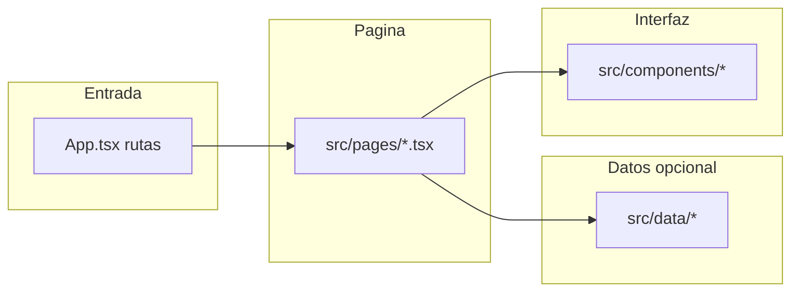

# Navegación del código (mapa para colaboradores)

Este documento es el **hub técnico**: enlaza rutas del sitio con archivos fuente, datos y componentes. Para instalación y comandos básicos, usa primero el [README en la raíz](../README.md).

## Convenciones del proyecto

- **Alias `@/`**: en imports, `@/` equivale a la carpeta [`src/`](../src/). Ejemplo: `@/components/GlobalHeader` → `src/components/GlobalHeader.tsx`.
- **Rutas de la app**: se registran en [`src/App.tsx`](../src/App.tsx) con `react-router-dom`. Cada pantalla se carga con **`lazy(() => import(...))`** (código dividido: la página no se descarga hasta que el usuario visita esa ruta).
- **Comentarios en código**: cada archivo en `src/pages/` incluye un bloque inicial que resume URL, datos y piezas grandes de UI. Los bloques por sección en `App.tsx` agrupan rutas relacionadas.
- **Diseño visual detallado**: reglas amplias en [`.cursor/rules/projectdesignsystem.mdc`](../.cursor/rules/projectdesignsystem.mdc) (equipo Cursor); tokens de color en [`src/index.css`](../src/index.css).

## Tabla: ruta del sitio → archivo de página

| Ruta (URL) | Archivo | Propósito breve |
|------------|---------|-----------------|
| `/` | [`src/pages/Index.tsx`](../src/pages/Index.tsx) | Inicio: cabecera global + hero. |
| `/about` | [`src/pages/About.tsx`](../src/pages/About.tsx) | Acerca de (scroll narrativo; sin cabecera global del resto del sitio). |
| `/quiz` | [`src/pages/QuizExpress.tsx`](../src/pages/QuizExpress.tsx) | Cuestionario corto (express): pocas preguntas y resultado rápido. |
| `/quiz/personalizado` | [`src/pages/QuizPersonalizado.tsx`](../src/pages/QuizPersonalizado.tsx) | Cuestionario completo por pasos (bienvenida, edad, plataformas, etc.). |
| `/aprende/tu-familia` | [`src/pages/TuFamilia.tsx`](../src/pages/TuFamilia.tsx) | Contenido “Tu familia y las pantallas”. |
| `/aprende/tu-familia/redes-sociales` | [`src/pages/TuFamiliaRedesSociales.tsx`](../src/pages/TuFamiliaRedesSociales.tsx) | Enfoque en redes sociales y plataformas. |
| `/aprende/tu-familia/videojuegos` | [`src/pages/TuFamiliaVideojuegos.tsx`](../src/pages/TuFamiliaVideojuegos.tsx) | Enfoque en videojuegos. |
| `/aprende/riesgos` | [`src/pages/RiesgosDigitales.tsx`](../src/pages/RiesgosDigitales.tsx) | Catálogo de riesgos digitales y modales. |
| `/aprende/controles` | [`src/pages/ControlesParentales.tsx`](../src/pages/ControlesParentales.tsx) | Guía de controles parentales. |
| `/aprende/comunicacion` | [`src/pages/ComunicacionYApoyo.tsx`](../src/pages/ComunicacionYApoyo.tsx) | Comunicación y apoyo; historias de caso. |
| `/aprende/acciones-legales` | [`src/pages/AccionesLegales.tsx`](../src/pages/AccionesLegales.tsx) | Acciones legales y recursos. |
| `/recursos` | [`src/pages/Recursos.tsx`](../src/pages/Recursos.tsx) | Recursos descargables, glosario en página y enlaces. |
| `/ayuda` | [`src/pages/Ayuda.tsx`](../src/pages/Ayuda.tsx) | Ayuda, contacto y FAQs enlazadas. |
| `/en-construccion` | [`src/pages/EnConstruccion.tsx`](../src/pages/EnConstruccion.tsx) | Placeholder para secciones pendientes. |
| `/print/plan` | [`src/pages/print/Plan.tsx`](../src/pages/print/Plan.tsx) | Vista de impresión / plan personalizado (construye plan desde datos del quiz o estado). |
| `*` (cualquier otra) | [`src/pages/NotFound.tsx`](../src/pages/NotFound.tsx) | Página 404. |

**Globales (no son rutas):** en `App.tsx`, botones flotantes de emergencia e información (`EmergencyButton`, `FEInfoButton`) en casi todas las rutas excepto `/about`.

## Diagrama: de la URL al código

## Si quieres cambiar…

| Objetivo | Dónde mirar primero |
|----------|---------------------|
| Texto de una pantalla concreta | El `.tsx` en [`src/pages/`](../src/pages/) de esa ruta (tabla arriba). |
| Listas, glosario técnico, riesgos, recursos en datos | [`src/data/README.md`](../src/data/README.md) y el archivo citado (p. ej. `risks.ts`, `recursos.ts`, `glossary.ts`). |
| Lógica del quiz (pasos, localStorage, analíticas) | [`src/hooks/README.md`](../src/hooks/README.md) → `useQuizState`, `useExpressQuizState`. |
| Texto del plan impreso o reglas de generación | [`src/data/plan/rules.ts`](../src/data/plan/rules.ts), `plan/blocks.ts`, componentes en `src/components/plan/`. |
| Colores y tipografía globales | [`src/index.css`](../src/index.css), [`tailwind.config.ts`](../tailwind.config.ts). |
| Imágenes optimizadas (hero, logos) | [`scripts/optimize-images.js`](../scripts/optimize-images.js), `src/assets/`, `public/optimized/` (cuando exista salida del script). |

## Lecturas por carpeta (índices)

- [README de páginas](../src/pages/README.md)
- [README de componentes](../src/components/README.md)
- [README de datos](../src/data/README.md)
- [README de hooks](../src/hooks/README.md)

## Mantenimiento

Al **agregar o renombrar una ruta** en `App.tsx`, actualiza en el mismo cambio:

1. Esta tabla en `docs/NAVEGACION-CODIGO.md`.
2. [`src/pages/README.md`](../src/pages/README.md).
3. El bloque de comentario al inicio del archivo de página afectado.
